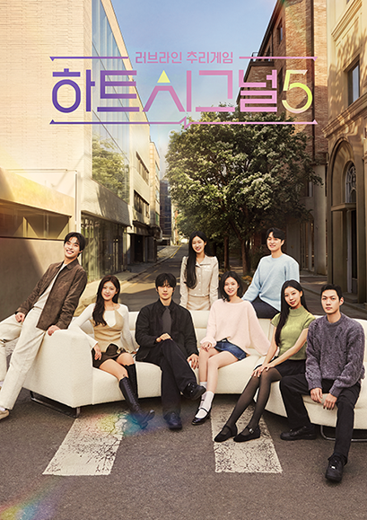

연애 리얼리티의 대표 격인 **'하트시그널5'** 가 종영을 앞두고 출연자들의 감정선이 최고조에 이르며 화제입니다. 시청자들의 최대 관심사인 **최종 선택**을 앞두고, 지금까지의 관계 흐름과 관전 포인트를 스포일러 없이 정리했습니다.

## '하트시그널'이 매번 화제인 이유

일반인 출연자들이 한집에서 지내며 문자·데이트로 마음을 표현하고, 패널들이 이를 추리·해설하는 포맷입니다. **직접적인 고백 없이도 오가는 미묘한 신호**를 지켜보는 재미가 핵심이라, 회차가 진행될수록 '누가 누구를 좋아하는가'를 두고 시청자 추리가 뜨거워집니다. 시즌5 역시 종반부로 갈수록 관계가 얽히며 몰입도가 높아지고 있습니다.

<figure class="medium"><figcaption>출처: 하트시그널 공식홈페이지</figcaption></figure>

## 주요 관전 포인트 (스포일러 최소화)

방송에서 부각된 흐름을 큰 줄기로만 정리하면:

- **오해를 풀어가는 커플 라인** — 그간 쌓였던 오해와 앙금을 대화로 풀며 서로의 마음을 확인하는 과정이 그려졌습니다. 솔직한 '돌직구' 대화가 관계의 분기점이 됐습니다.
- **삼각관계의 긴장** — 한 출연자를 둘러싼 감정 경쟁이 이어지며, 눈물이 비치는 장면까지 나올 만큼 감정이 격해졌습니다.

각 인물의 최종 선택이 서로를 향할지는, 방송을 통해 확인하는 것이 이 프로그램의 묘미입니다.

## 최종회를 더 재밌게 보는 법

- **관계도 미리 그려보기**: 누가 누구에게 호감을 보였는지 간단히 정리해두면 최종 선택의 반전이 더 극적으로 느껴집니다.
- **패널 해설과 내 추리 비교**: 방송 중 패널들의 예측과 내 예상을 맞춰보는 것도 재미 포인트입니다.
- **SNS 반응은 종영 후에**: 실시간 반응에는 스포일러가 많으니, 본방 시청을 원한다면 방송 후 확인하는 것을 추천합니다.

## 정리

'하트시그널5'는 종반부 감정선이 절정에 달하며 최종 선택에 대한 관심이 커지고 있습니다. 관계도를 미리 정리하고 패널 해설과 내 추리를 비교하며 보면, 마지막 회의 재미가 배가됩니다.

---

### 참고 자료
- '하트시그널5' 관련 보도 — 머니투데이, 일간스포츠, 네이트 등
