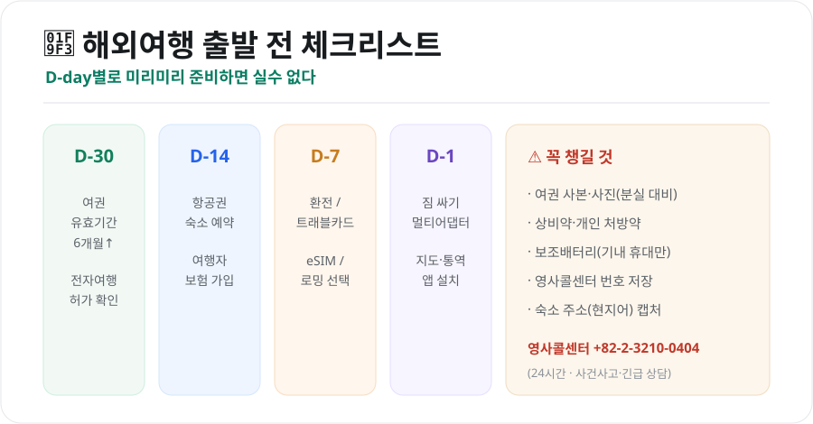
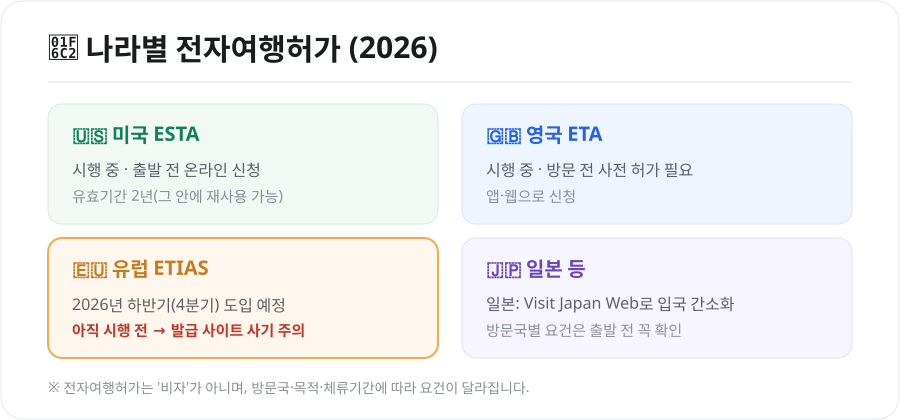

설레는 해외여행, 준비가 반입니다. 여권 유효기간을 놓쳐 출국장에서 막히거나, 통신·환전을 잘못 골라 돈을 더 쓰는 일은 조금만 알아두면 피할 수 있습니다. 출발 전부터 현지까지, 꼭 필요한 꿀팁만 모았습니다.

<figure class="large"><figcaption>해외여행 출발 전 D-day 체크리스트 (자료 정리: 키워드픽)</figcaption></figure>

## 1. 출발 전 서류 — 여권과 전자여행허가

### 여권 유효기간 6개월 이상
많은 나라가 **입국일 기준 여권 유효기간이 6개월 이상** 남아 있을 것을 요구합니다. 남은 기간이 애매하면 미리 재발급하세요.

### 전자여행허가(ETA) 확인
비자가 필요 없는 나라라도 **사전 전자여행허가**를 받아야 하는 경우가 늘고 있습니다.

<figure class="large"><figcaption>나라별 전자여행허가 한눈에 (자료 정리: 키워드픽)</figcaption></figure>

- **미국 ESTA**: 시행 중. 출발 전 온라인 신청(유효기간 2년)
- **영국 ETA**: 시행 중. 방문 전 앱·웹으로 사전 허가
- **유럽 ETIAS**: **2026년 하반기(4분기) 도입 예정**. 아직 시행 전이라 **발급받을 수 없으니**, "지금 발급해준다"는 사이트는 **사기**를 의심하세요.
- **일본**: Visit Japan Web으로 입국 심사·세관을 간소화

> 전자여행허가는 '비자'가 아니며, 방문국·체류기간에 따라 요건이 다릅니다. **반드시 공식 사이트**에서, 출발 며칠 전 여유 있게 신청하세요.

## 2. 통신 — 로밍 vs eSIM vs 포켓와이파이

현지에서 인터넷을 쓰는 방법은 크게 세 가지입니다.

| 방법 | 장점 | 단점 |
|---|---|---|
| **데이터 로밍** | 번호 그대로, 가입 간편 | 상대적으로 비쌀 수 있음 |
| **eSIM** | 저렴·즉시 개통, 앱으로 설치 | eSIM 지원 단말기만 가능 |
| **포켓와이파이** | 여러 명·기기 공유 | 기기 대여·충전·반납 번거로움 |

- **혼자 여행 + 최신 스마트폰**이면 **eSIM**이 가성비가 좋습니다.
- **여러 명이 함께**라면 포켓와이파이를 나눠 쓰는 것도 방법입니다.
- 전화·문자를 그대로 받아야 하면 **로밍**이 편리합니다.

## 3. 환전·결제 — 수수료를 줄이자

- **트래블 체크카드**(해외결제 특화 카드)를 활용하면 환전 수수료를 아끼고 현지 ATM 출금도 편합니다.
- **현지 통화로 결제**하세요. 해외에서 "원화(KRW)로 결제할까요?"라고 물으면 **거절**하는 게 이득입니다(원화결제 DCC는 수수료가 더 붙습니다).
- **소액 현금**은 팁·시장·교통 등을 위해 조금만 준비하고, 큰 금액은 카드로 쓰는 것이 안전합니다.

## 4. 짐 싸기 — 규정과 필수품

- **기내 반입 액체**: 용기당 **100ml 이하**, 1L 투명 지퍼백 1개에 모아서. 큰 화장품·세면도구는 위탁수하물로.
- **보조배터리·라이터**: **위탁수하물 금지**, 반드시 **기내 휴대**(용량 제한 확인).
- **멀티 어댑터(돼지코)**: 나라마다 콘센트 규격이 다릅니다. 유럽·미국·일본 등 방문지에 맞는 어댑터를 챙기세요.
- **상비약·처방약**: 현지에서 구하기 어려울 수 있으니 개인 약은 넉넉히. 처방약은 처방전 사본을 함께.

## 5. 현지·안전 — 이것만은 기억

- **영사콜센터 저장**: 사건·사고나 긴급 상황 시 **+82-2-3210-0404**(24시간). 여권 분실·도난 시에도 도움을 받을 수 있습니다.
- **여권 사본·사진**을 따로 보관하면 분실 시 재발급이 빠릅니다.
- **소매치기 주의**: 관광지·대중교통에서 가방은 앞으로, 뒷주머니 지갑은 피하세요.
- **숙소 주소를 현지어로 캡처**해두면 택시·길 찾기에 유용합니다.
- **여행자보험**은 치료비·휴대품 손해·항공 지연까지 대비하니, 짧은 여행이라도 가입을 권합니다.

## 6. 소소하지만 유용한 팁

- **항공권 유류할증료는 '발권일' 기준**이라, 인하 흐름이면 발권을 서두르지 않는 것도 방법입니다.
- **입국 심사**를 대비해 왕복 항공권·숙소 예약 내역을 캡처해두면 좋습니다.
- **구글 지도 오프라인 저장**, **번역 앱**을 미리 설치·다운로드하세요.
- 시차가 큰 지역은 **도착지 시간에 맞춰** 기내에서 수면을 조절하면 시차 적응이 쉽습니다.

## 마무리

해외여행의 실수는 대부분 **준비 단계에서 예방**할 수 있습니다. 여권·전자여행허가부터 통신·환전·보험까지, 위 체크리스트만 따라가면 출발 당일 당황할 일이 줄어듭니다. 안전하고 즐거운 여행 되세요!

---

*본 글은 공개된 자료를 바탕으로 정리한 참고용 정보입니다. 비자·전자여행허가·기내 반입 규정 등은 국가·항공사·시점에 따라 다르므로, 출발 전 방문국 공관·항공사의 최신 안내를 반드시 확인하시기 바랍니다.*

**참고 자료**
- 외교부 해외안전여행(영사콜센터 안내)
- 유럽 ETIAS·미국 ESTA·영국 ETA 공식 안내
