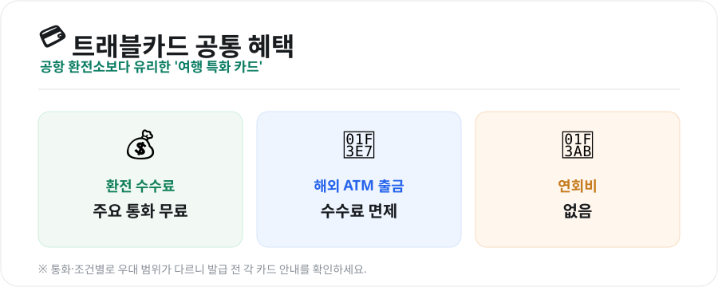
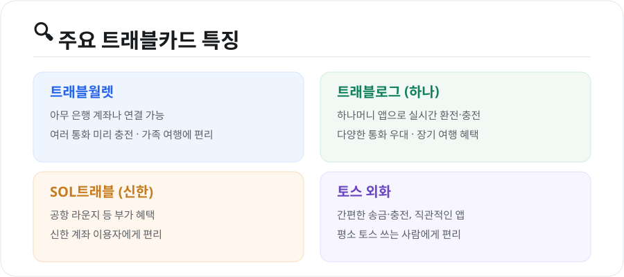

해외여행 경비에서 은근히 새는 돈이 **환전 수수료**입니다. 공항 환전소나 일반 카드 해외결제는 수수료가 붙지만, 요즘은 **여행 특화 트래블카드**로 이를 크게 아낄 수 있습니다. 주요 앱·카드를 비교해봤습니다.

<figure class="large"><figcaption>트래블카드 공통 혜택 (자료 정리: 키워드픽)</figcaption></figure>

## 1. 트래블카드, 뭐가 좋은가

대표 트래블카드들은 대체로 아래 혜택을 공통으로 제공합니다.

- **주요 통화 환전 수수료 무료**
- **해외 현지 ATM 출금 수수료 면제**
- **연회비 없음**

앱으로 미리 원하는 통화를 **충전(환전)**해두고, 현지에서 카드로 결제하거나 ATM에서 현금을 뽑는 방식입니다. 공항 환전소보다 환율이 유리한 경우가 많습니다.

## 2. 주요 카드 비교

<figure class="large"><figcaption>주요 트래블카드 특징 (자료 정리: 키워드픽)</figcaption></figure>

| 카드 | 특징 | 이런 사람에게 |
|---|---|---|
| **트래블월렛** | 아무 은행 계좌나 연결, 여러 통화 충전 | 계좌 자유롭게·가족 여행 |
| **트래블로그(하나)** | 하나머니로 실시간 환전, 통화 우대 다양 | 장기·다국가 여행 |
| **SOL트래블(신한)** | 공항 라운지 등 부가 혜택 | 신한 이용자·부가혜택 원함 |
| **토스 외화** | 간편 송금·충전, 직관적 앱 | 평소 토스 쓰는 사람 |

- **트래블월렛**은 특정 은행에 묶이지 않아, 쓰던 계좌를 그대로 연결할 수 있고 **가족 각자 발급**해 쓰기 좋습니다.
- **트래블로그**는 하나머니 앱으로 **다양한 통화를 우대 환전**할 수 있어 여러 나라를 도는 여행에 유용합니다.
- **SOL트래블**은 **공항 라운지** 같은 부가 혜택이, **토스**는 **간편함**이 강점입니다.

## 3. 상황별 추천

- **가까운 일본·동남아 단기여행** → 어느 카드든 무난, 쓰던 앱 기준으로 선택
- **여러 나라 장기여행** → 다통화 우대가 좋은 **트래블로그·트래블월렛**
- **부가 혜택(라운지 등) 원함** → **SOL트래블**
- **송금·충전 간편함 우선** → **토스**

## 4. 해외결제 절약 팁

- **현지 통화로 결제**하세요. "원화(KRW)로 결제할까요?"는 **거절**(원화결제 DCC는 수수료가 더 붙습니다).
- **소액 현금 + 카드 병행**: 시장·팁·교통은 현금, 큰 금액은 카드가 안전합니다.
- **충전식 카드 잔액 관리**: 여행 후 남은 외화는 재환전 시 손해가 날 수 있으니 필요한 만큼만 충전하세요.
- **분실 대비**: 앱에서 즉시 카드 정지가 가능하니 사용법을 익혀두세요.

## 마무리

트래블카드는 **환전 수수료·ATM 수수료·연회비가 없는** 여행 필수템이 됐습니다. 큰 차이보다는 **쓰던 은행·앱, 다통화 우대, 부가 혜택** 중 무엇을 중시하느냐로 고르면 됩니다. 어떤 카드든 **현지 통화 결제**만 지키면 수수료를 확실히 아낄 수 있습니다.

---

*본 글은 공개된 자료를 바탕으로 정리한 참고용 정보입니다. 특정 카드를 광고하지 않으며, 수수료·우대·혜택 조건은 수시로 바뀌므로 발급 전 각 사 공식 안내를 확인하시기 바랍니다.*

**참고 자료**
- 각 트래블카드(트래블월렛·하나 트래블로그·신한 SOL트래블·토스) 공식 안내
- 카드사 해외이용 수수료 안내
